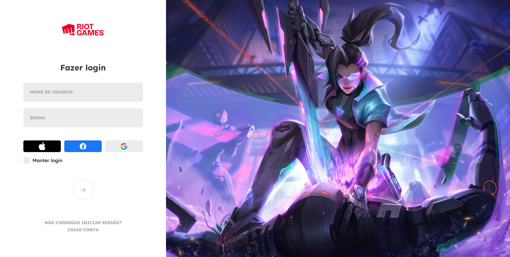

<h1 align="center"> Página de login </h1>

Página de login criada utilizando HTML, CSS e JavaScript, com base nos ensinamentos do [vídeo - Tela de Login do League of Legends com HTML, CSS e JavaScript | CSS Tutorial](https://youtu.be/tyVvNj-UvxM) do canal [@ManualdoDev](https://www.youtube.com/@ManualdoDev) no Youtube. 

  <a href="#-tecnologias">🚀 Tecnologias</a>&nbsp;&nbsp;&nbsp;|&nbsp;&nbsp;&nbsp;
  <a href="#-projeto">💻 Projeto</a>&nbsp;&nbsp;&nbsp;|&nbsp;&nbsp;&nbsp;
  <a href="#-layout">🔖 Layout</a>&nbsp;&nbsp;&nbsp;|&nbsp;&nbsp;&nbsp;
  <a href="#memo-licença">:memo: Licença</a>

 

  

## 🚀 Tecnologias

Esse projeto foi desenvolvido com as seguintes tecnologias:

- HTML 
- CSS
- JavaScript

## 💻 Projeto

A página de login do jogo League of Legends foi recriada nesse projeto usando vários ensinamentos importantes do CSS e do JavaScript, tais como, seletores avançados, pseudo-elementos, funções, eventos, dentre outros.

## 🔖 Layout

Você pode navegar pelo projeto através [DESSE LINK](https://thiagomonts.github.io/pagina-login/).

## :memo: Licença

Esse projeto está sob a licença MIT.

---

Desenvolvido por [Thiago Honorato](https://www.linkedin.com/in/honoratothiago/)
